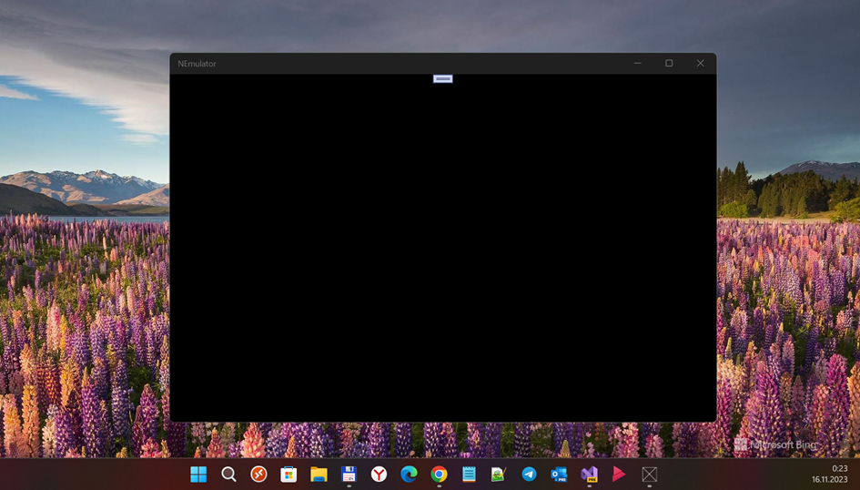

# NEmulator, or C# NES Emulator

My fork of CodeSourcerer's Emulator project. Goal: little RnD (video / audio subsystems coding).
Draft / Pre-alpha. 

## Screenshot(s) (Target: win 11 on desktop pc, not W10M yet...)

## A few words from the author
"This is my NES emulator written in C#. A great deal of this is based on an emulator that can be found [here](https://github.com/OneLoneCoder/olcNES)."

## My 2 cents
- .NET Core app base -> UWP   (min. Win. os SDK = 17763)
- OpenTK + UWP "experimentation"
- csPixelGameEngineCore -> GameEnginCore (draft)

## Building
I use Visual Studio 2022 Preview (Community Edition) while developing this project, so if you have it available you can simply open the solution file - otherwise you will have to add in the 
appropriate project files into your own solution.

### Windows
Try to use the NEmulatorApp for the main/default project... 

Note: This project adds some nuget package for OpenAL that is ported to work with .NET core. It appears to be a forked project that is not supported by the people who support OpenAL (?)

## Running status
- Failed (my veery old pc's videocard don't support OpenGL... heh... DX adaptation needed!)

### Notes for Windows use
You must go to OpenAL.org and [download the OpenAL SDK](https://www.openal.org/downloads/), if you do not already have it installed.

### Controls
#### Emulator
Space - Start/Stop emulator
R - Reset
F - Run a single frame of emulation
C - Step one CPU instruction

#### Controller (Player 1)
A - Start
S - Select
Z - B
X - A
Arrows control D-pad

Player 2 controls not yet supported.

## Current Supported Features
* 6502 CPU - Complete (undocumented opcodes not supported)
* 2C02 PPU - Complete
* 2A03 APU - In Progress
	* Pulse channels 1 & 2 - Complete
	* Triangle channel - Complete
	* Noise channel - Complete
	* DMC channel - In Progress, still buggy
* Mappers - In Progress
	* Battery saves - Not yet implemented
	* Mapper 000 - Complete
	* Mapper 001 - Complete
	* Mapper 002 - Complete
	* Mapper 003 - Complete
	* Mapper 004 - In progress (need to test IRQ handling)

## TODO
- Complete GameEngineCore module
- Fix damaged video output
- Fix audio...

## Reference(s)
- https://github.com/CodeSourcerer/
- https://github.com/CodeSourcerer/Emulator

## ..
As is. No support. RnD only. DIY

## .
[m][e] 2023
